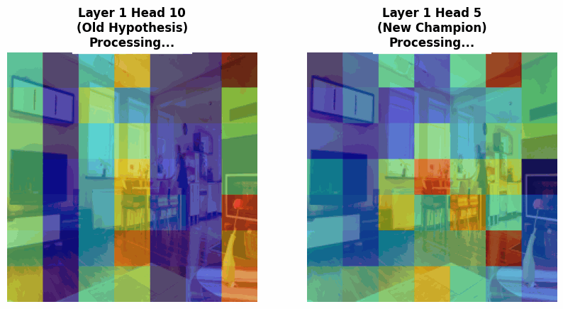
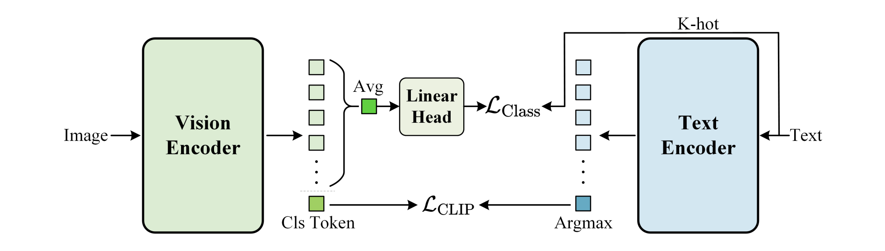

# SuperCLIP-Nebula: Efficient Vision-Language Alignment

**A high-performance implementation of [SuperCLIP (NeurIPS 2025)](https://arxiv.org/abs/2512.14480) optimized for HPC clusters.**

### **Project Overview**

This project reproduces the **SuperCLIP** architecture, which augments standard Contrastive Language-Image Pretraining (CLIP) with token-level classification supervision. While vanilla CLIP relies on massive batch sizes (32k+) for learning signals, SuperCLIP stabilizes training on **small batches** by forcing the vision encoder to predict caption tokens directly.

This implementation was engineered to run efficiently on a **dual-node NVIDIA A4500 cluster**, overcoming Distributed DataParallel (DDP) scaling issues and Network File System (NFS) I/O bottlenecks. I have uploaded the last epoch under `logs/final_epoch.pt` (take a look if you're interested)!

### **Key Results**

> **"Does Token Supervision force the model to 'see' objects earlier?"**

Beyond standard metrics, I conducted a mechanistic study to map the internal attention circuits of the Vision Transformer.

**The Discovery: Late-Stage Crystallization**
I initially hypothesized that SuperCLIP would ground objects early (Layer 7). However, rigorous testing falsified this. Automated circuit discovery revealed that while the model "scans" early on, precise spatial grounding is a late-stage phenomenon, crystallizing generally at **Layer 12**.


*Figure: (Left) Layer 7 attempts to focus but fades (our initial hypothesis). (Right) **Layer 12 Head 6** locks onto the object with 81% precision.*

[**Read the Full Research Report & Analysis**](./research/README.md)
*(Includes automated circuit sweeps, ablation studies, and falsification of the "Early Grounding" hypothesis)*

Evaluated on held-out **COCO-2017 Validation** data.
*Train Set: 4,000 Images | Test Set: 1,000 Images (Strict Split) [due to academic compute constraint]*

| Model Config | Recall@1 | Recall@5 | Recall@10 | Hardware |
| --- | --- | --- | --- | --- |
| **SuperCLIP** | **46.60%** | **75.50%** | **86.80%** | 2x A4500 (20GB) |
| Vanilla CLIP Baseline | 42.30% | 72.20% | 83.60% | 2x A4500 (20GB) |
| **Improvement** | **+4.3%** | **+3.3%** | **+3.2%** | |

> **Note:** Achieved **92.4% Recall@1** on the training set (convergence check), validating the custom loss implementation and distributed gathering logic.

### **Technical Implementation**

#### **Model Architecture**



I implemented the dual-loss objective from the paper, which highlighted these key features:

* Contrastive: Standard InfoNCE loss aligning global image/text embeddings.
* Classification: A lightweight linear head projecting visual features to the text vocabulary space (), optimized via BCE.
* Impact: Mitigates the performance degradation typical of small-batch training (Batch Size < 512).

#### **Engineering Highlights (self-document!)**

* NFS-Free Streaming: Due to Network File System (NFS) constraints, I had to engineer a custom ETL pipeline to convert raw COCO images into WebDataset (`.tar`) shards. This replaced millions of random small-file reads with sequential streaming. Had a lot of fun learning this!
* Distributed Training: Learned and utilized `torch.nn.DataParallel` and Mixed Precision (AMP) to maximize throughput on dual A4500 GPUs, achieving ~99% GPU utilization, and taught me the core MLE skills!
* Bug Fixes: Ran into a lot of different bugs w.r.t. the dataset and data pre-processing. I had to resolve distributed training artifacts where scalar outputs (e.g., `logit_scale`) were incorrectly concatenated across GPU devices during loss calculation.

### **Quick Start**

**1. Environment Setup**

```bash
# Recommended: Python 3.10 (Stable for OpenCLIP/Torch 2.1)
pip install -r requirements.txt

```

**2. Data Ingestion (ETL)**

Download the COCO-2017 data set and pack it into streaming shards (80/20 Train/Val Split)

```bash
mkdir -p data/ && cd data

wget http://images.cocodataset.org/zips/val2017.zip
wget http://images.cocodataset.org/annotations/annotations_trainval2017.zip

python3 -m zipfile -e val2017.zip .
python3 -m zipfile -e annotations_trainval2017.zip .

cd ..

python data/create_coco_shard.py
```

**3. Training (SLURM / Local)**

I was using a training cluster with SLURM, but you can replicate this locally if you have local compute

```bash
# SLURM Cluster Submission
sbatch scripts/run_train.sh

# Or Local Run
python src/train.py --batch-size 128 --epochs 20

```

**4. Evaluation**

After the training is complete (with no errors), run the `src/eval.py` file to evaluate
```bash
# Automatically finds the latest checkpoint
python src/eval.py

# will output something like this:
# ---SuperCLIP Results (Held-Out Data) ---
# Recall@1:  46.60%
# Recall@5:  75.50%
# Recall@10: 86.80%

```

### **Acknowledgments & Attribution**
This repository is an unofficial implementation and extension of the following works. All credit for the original architectures goes to the respective authors.

**SuperCLIP (NeurIPS 2025)**

- Authors: Weiheng Zhao, Zilong Huang, Jiashi Feng, Xinggang Wang
- Affiliations: HUST Vision Lab & Bytedance
- Original Repo: [hustvl/SuperCLIP](https://github.com/hustvl/SuperCLIP)

**CLIP (OpenAI)**

- Authors: Alec Radford, Jong Wook Kim, Chris Hallacy, et al.
- Original Repo: [openai/CLIP](https://github.com/openai/CLIP)

### **Citation**

Huge thanks to the authors [Weiheng Zhao](https://github.com/SleepingWhz), [Zilong Huang](https://github.com/speedinghzl), Jiashi Feng, and [Xinggang Wang](https://github.com/xinggangw). This project creates an unofficial implementation of the paper. If you use the SuperCLIP architecture in your research, please cite the original paper from the authors!

```bibtex
@article{zhao2025superclip,
  title={SuperCLIP: CLIP with Simple Classification Supervision},
  author={Zhao, Weiheng and Huang, Zilong and Feng, Jiashi and Wang, Xinggang},
  journal={arXiv preprint arXiv:2512.14480},
  year={2025},
  url={https://arxiv.org/abs/2512.14480}
}

```
