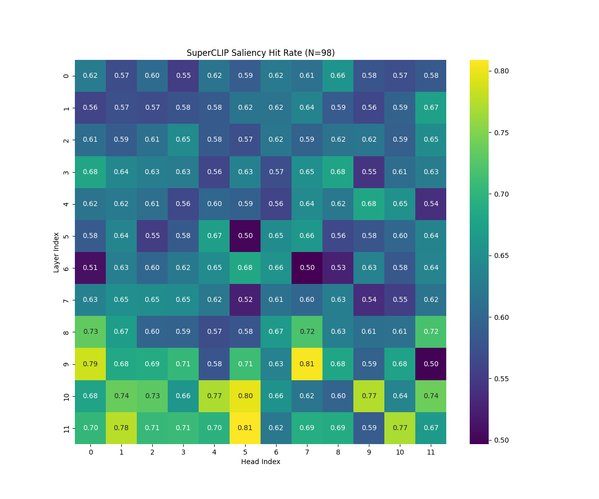
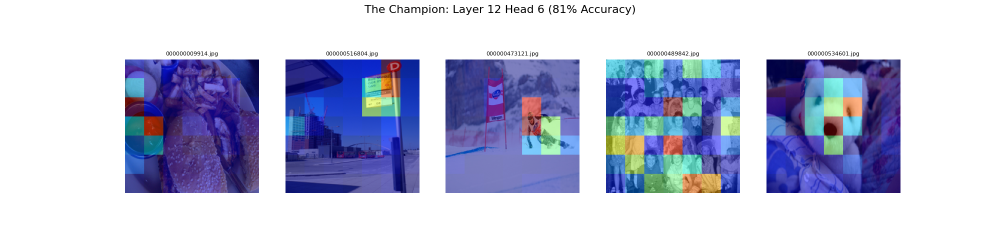

# Mechanistic Evidence of Late-Stage Spatial Grounding in ViTs
## Abstract
Standard CLIP models are often treated as "black boxes" that only yield semantic meaning at the final layer. By training **SuperCLIP** (a ViT with auxiliary token-classification loss), I investigated where and how the model localizes semantic objects.

Using **Logit Lens** and **Automated Circuit Discovery**, I falsified my early hypothesis of "Early Grounding." While the model attempts to locate objects at Layer 7, these representations are unstable. Instead, I identified a specific circuit (Layer 12, Head 6) that acts as a "Saliency Anchor," crystallizing spatial attention only in the final processing step.

## Investigation: "Where is the Table?"

I tracked the attention of specific heads as the model processed an image of a woman standing by a table.

### **The Hypothesis: Early Grounding (Layer 7)**
Initial probes suggested Layer 7 was the "waking up" point. The Logit Lens showed the concept "table" rising in rank here, and visual inspection of **Head 10** seemed promising.

### **Falsification of Initial Hypothesis**
However, quantitative analysis on 100 random images revealed Layer 7 Head 10 had a hit rate of only **66%** against ground-truth bounding boxes...barely better than a random head (63%).

### Late-Stage Crystallization (Layer 12)
I ran an automated sweep across all 144 attention heads (12 Layers × 12 Heads) to find the true saliency circuit, since my initial hypothesis of an early grounding at Layer 7 turned out to be image-specific.

This heatmap reveals that robust spatial grounding is a late-stage phenomenon.

* **Layer 12, Head 6** achieved an **80.9% intersection rate** with ground-truth objects.
* Random chance (Center Prior) was ~55%.

## Visualizing the Mechanism

Comparing Layer 7 against the Layer 12 reveals the difference in mechanism.

* **Left (Old Hypothesis):** Layer 7 Head 10 briefly tightens around the object but is unstable and fades.
* **Right (New Champion):** Layer 12 Head 6 remains dormant until the final layer, where it snaps into a razor-sharp focus on the semantic subject.

## Validation

To verify Layer 12 Head 6 is a "Universal Saliency Head" and not just a fluke, I visualized it across diverse unseen images.

**Observation:**
In complex scenes (crowds, clutter, sports), Head 6 ignores the background and consistently "paints" the primary semantic subject (faces, signs, bodies, food), confirming that it is a critical component of the model's final inference circuit.
